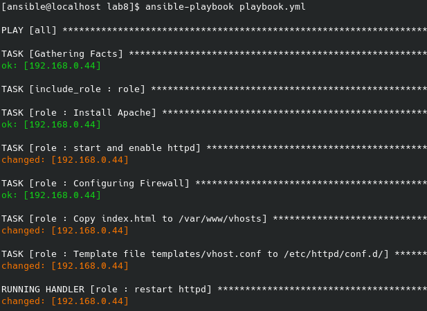

# Ansible Role to Create Virtual Hosts

* This project contains a Ansible role to create Apache virtual hosts (the domain name will be the hostname of the remote machine) on RHEL/CentOS system.

* Role execution:

  

* Result on browser:

  

